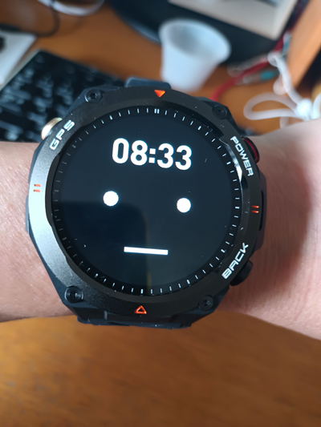
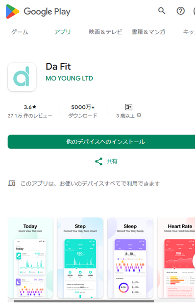
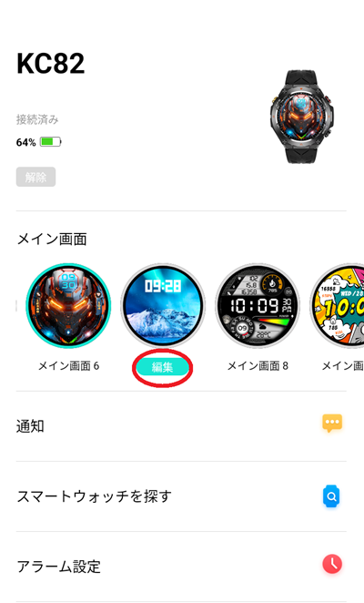
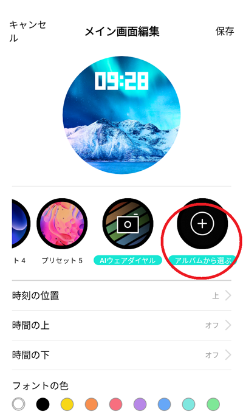
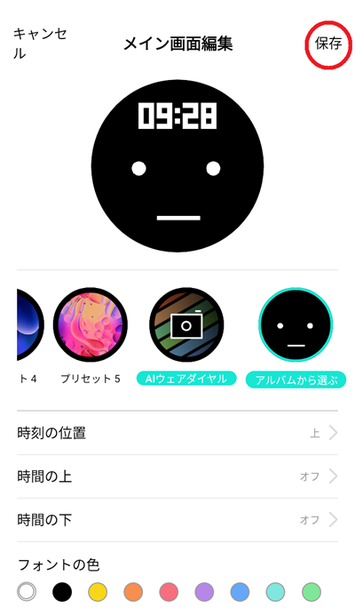

# stackChanFace_for_smartWatch
スマートウォッチに、スタックチャンの顔を表示する方法。 
文字盤をスタックチャン顔に変更する手順を記述します。 

  

## 準備
スマートウォッチの文字盤に使用する画像を準備します。 
私が作ったスタックチャン顔の画像データは、"copy-to-smartPhone"フォルダ下の　"stackChanFace.png"ファイルです。 
この画像のデータは、上部のおでこ部分を時刻表示用に広くとっています。 
ご自身で独自作成して使用することもできます。  

事前に、文字盤用の画像をスマート・ウォッチとリンクするスマホにコピーしてください。 

 

## DA Fit アプリ（Android版）での手順説明
私が使用しているスマホとスマートウォッチに依存しているのですが、 
スマホは、Android、けっこう使われている「DA Fit」アプリでの説明となります。 
使用機種が異なる場合でも、同様の機能があれば参考になると思います。 
  
### DA_Fitをスマホにインストール後、指示に従いスマートウォッチとスマホをリンクしてください。リンク完了後したら、次の画面を開きます。 

  
### 「メイン画面」で文字盤を変更できる場所の、「編集」を押下します。<b>

  
### 「メイン画面編集」で「アルバムから選ぶ」を押下します。
その後、先にスマホにコピーしていた、スタックチャン顔（stackChanFace.png）の画像を選択します。 

  
### 画像のデータは、上部のおでこ部分を時刻表示用に広くとっていますが、上下左右を調整してその後、この画面で「保存」を押下してください。
これで完了です。
